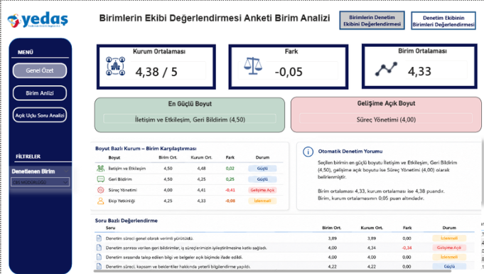

# ic-denetim-anketi-uygulamasinda-surec-iyilestirme-
İç denetim anketlerinin standartlaştırılması, Power BI dashboardları ve web tabanlı raporlama sistemi.

## Proje Hakkında

Bu proje, iç denetim süreçlerinin analiz edilmesi, anket değerlendirme yapısının standartlaştırılması ve karar verme sürecini destekleyen veri odaklı bir raporlama sistemi geliştirilmesi amacıyla hazırlanmıştır.

Proje kapsamında mevcut anket yapısı analiz edilmiş, farklı dönemlerde kullanılan değerlendirme yöntemleri standartlaştırılmış ve analiz sonuçlarının etkileşimli olarak izlenebilmesi için Power BI dashboardları ile web tabanlı bir raporlama sistemi geliştirilmiştir.

---

## Projenin Amacı

- İç denetim anketlerinin standartlaştırılması
- Karar verme sürecini destekleyen raporlama yapısının oluşturulması
- Power BI dashboardları geliştirilmesi
- Web tabanlı analiz ekranlarının tasarlanması

---

## Power BI Dashboardları

İç denetim anketlerinin izlenebilirliğini artırmak ve karar verme sürecini desteklemek amacıyla etkileşimli Power BI dashboardları geliştirilmiştir. Dashboardlar sayesinde kullanıcılar genel performansı izleyebilmekte, birim ve boyut bazlı analizler yapabilmekte ve dönemsel değişimleri inceleyebilmektedir.

### Genel Değerlendirme Dashboardı

Kurum genelindeki performans göstergeleri ve anket sonuçlarının özet görünümü sunulmaktadır.

---

### Boyut Analizi Dashboardı

Anket boyutları karşılaştırılarak güçlü ve gelişime açık alanlar analiz edilmektedir.

---

### Birim Analizi Dashboardı

Birim performansları karşılaştırılmakta ve kurum ortalaması ile değerlendirilmektedir.

---

### Trend Analizi Dashboardı

Anket sonuçlarının dönemlere göre değişimi analiz edilerek performans eğilimleri takip edilmektedir.

---

## Web Tabanlı Raporlama Sistemi

Power BI dashboardlarına ek olarak analiz sonuçlarının daha kullanıcı dostu bir şekilde görüntülenebilmesi amacıyla web tabanlı bir raporlama sistemi geliştirilmiştir.

Web arayüzü sayesinde kullanıcılar farklı filtrelerle analiz yapabilmekte, performans sonuçlarını inceleyebilmekte ve dönemsel değişimleri etkileşimli olarak takip edebilmektedir.

### Genel Özet Sayfası

Genel performans göstergeleri ve anket sonuçları tek ekranda sunulmaktadır.

---

### Boyut Analizi Sayfası

Anket boyutları karşılaştırılarak güçlü ve gelişime açık alanlar analiz edilmektedir.

---

### Birim Analizi Sayfası

Birim performansları karşılaştırılarak detaylı değerlendirmeler sunulmaktadır.

---

### Trend Analizi Sayfası

Anket sonuçlarının dönemsel değişimi analiz edilerek performans eğilimleri görselleştirilmektedir.

---

## Proje Çıktıları

- İç denetim anketlerinin standartlaştırılması
- Veri odaklı analiz altyapısının oluşturulması
- Etkileşimli Power BI dashboardlarının geliştirilmesi
- Web tabanlı raporlama sisteminin geliştirilmesi
- Karar verme sürecini destekleyen analiz ve raporlama yapısının oluşturulması
